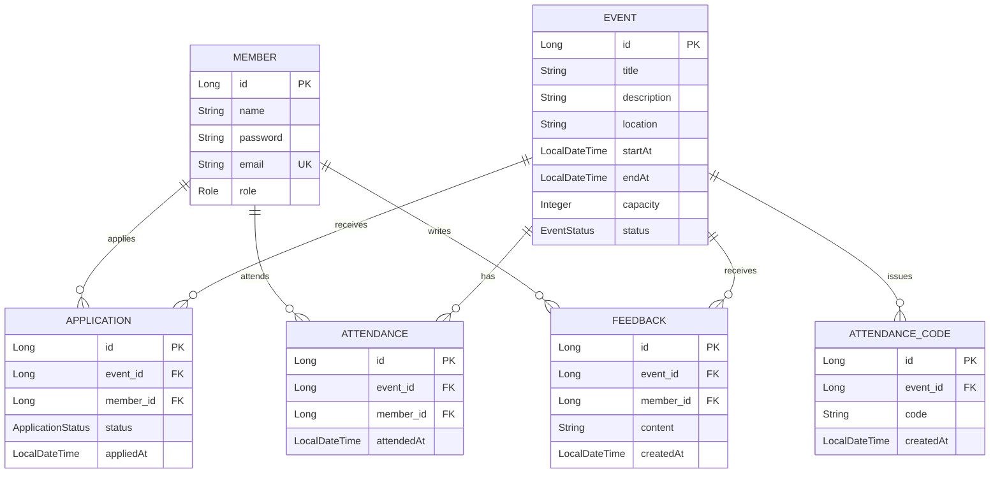

# Event Platform 프로젝트 명세

## 1. 프로젝트 개요

이 프로젝트는 행사 운영을 위한 Spring Boot 기반 API 서버와 간단한 정적 API 콘솔 프론트엔드로 구성되어 있다.

회원은 행사 목록을 조회하고, 특정 행사에 신청하고, 승인된 신청 건에 대해 출석 체크를 할 수 있으며, 완료된 행사에는 피드백을 남길 수 있다. 관리자는 행사를 생성/수정/삭제하고, 신청 상태를 변경하며, 출석 코드 발급, 출석 현황 조회, 피드백 조회, 대시보드 집계를 수행한다.

현재 프론트엔드는 완성된 사용자 서비스 화면이라기보다는 API 호출을 테스트하는 콘솔에 가깝다. 행사 신청, 행사 수정, 출석, 피드백 작성은 모두 사이드바의 `Event ID` 입력값을 기준으로 동작한다.

## 2. 기술 구성

| 구분 | 내용 |
| --- | --- |
| Language | Java 21 |
| Framework | Spring Boot 4.1.0 |
| Persistence | Spring Data JPA |
| Database | PostgreSQL |
| Security | Spring Security, JWT |
| Frontend | Spring static resources: `index.html`, `styles.css`, `app.js` |
| Response Wrapper | 성공 응답은 `ApiResponse<T>`로 감싸며 `status`, `message`, `data`를 포함 |
| Error Wrapper | 오류 응답은 `ErrorResponse`로 감싸며 `status`, `code`, `message`를 포함 |

## 4. 인증 및 권한

역할은 `Role.ADMIN`, `Role.MEMBER` 두 가지다.

`SecurityConfig` 기준 접근 정책은 다음과 같다.

| 경로 | 접근 |
| --- | --- |
| `/`, `/index.html`, `/styles.css`, `/app.js`, `/favicon.ico` | 전체 허용 |
| `/api/v1/auth/**` | 전체 허용 |
| `/api/v1/admin/**` | `ADMIN` 권한 필요 |
| 그 외 모든 API | 인증 필요 |

일부 컨트롤러 메서드는 `@PreAuthorize("hasRole('ADMIN')")`로 관리자 권한을 추가 확인한다.

## 5. 도메인별 엔드포인트

### Auth

Base path: `/api/v1/auth`

| Method | Endpoint | 권한 | Request | Response data | 설명 |
| --- | --- | --- | --- | --- | --- |
| POST | `/signup` | 전체 허용 | `email`, `password`, `name`, `role` | `Long memberId` | 회원가입 |
| POST | `/login` | 전체 허용 | `email`, `password` | `accessToken` | 로그인 및 JWT 발급 |

### Member

Base path: `/api/v1`

| Method | Endpoint | 권한 | Request | Response data | 설명 |
| --- | --- | --- | --- | --- | --- |
| GET | `/members/me` | 인증 필요 | 없음 | `MemberResponse` | 현재 로그인한 회원 정보 조회 |
| GET | `/admin/members` | `ADMIN` | 없음 | `List<MemberResponse>` | 전체 회원 목록 조회 |

### Event

Base path: `/api/v1`

| Method | Endpoint | 권한 | Request | Response data | 설명 |
| --- | --- | --- | --- | --- | --- |
| GET | `/events` | 인증 필요 | Query: `status` optional | `List<EventResponse>` | 행사 목록 조회, 상태 필터 가능 |
| GET | `/events/{eventId}` | 인증 필요 | Path: `eventId` | `EventResponse` | 행사 상세 조회 |
| POST | `/admin/events` | `ADMIN` | `title`, `description`, `location`, `startAt`, `endAt`, `capacity` | `EventResponse` | 행사 생성 |
| PUT | `/admin/events/{eventId}` | `ADMIN` | Path: `eventId`, body: 행사 수정 필드 | `EventResponse` | 행사 기본 정보 수정 |
| PATCH | `/admin/events/{eventId}/status` | `ADMIN` | `status` | `EventResponse` | 행사 상태 변경 |
| DELETE | `/admin/events/{eventId}` | `ADMIN` | Path: `eventId` | `null` | 행사 삭제 |

### Application

Base path: `/api/v1/events`

| Method | Endpoint | 권한 | Request | Response data | 설명 |
| --- | --- | --- | --- | --- | --- |
| POST | `/{eventId}/applications` | 인증 필요 | Path: `eventId` | `ApplicationResponse` | 특정 행사 신청 |
| GET | `/{eventId}/applications/me` | 인증 필요 | Path: `eventId` | `ApplicationResponse` | 내 신청 상태 조회 |
| DELETE | `/{eventId}/applications/me` | 인증 필요 | Path: `eventId` | `null` | 내 신청 취소 |
| GET | `/{eventId}/applications` | `ADMIN` | Path: `eventId` | `List<ApplicationResponse>` | 특정 행사 신청자 목록 조회 |
| PATCH | `/{eventId}/applications/{applicationId}/status` | `ADMIN` | Path: `eventId`, `applicationId`, body: `status` | `ApplicationResponse` | 신청 상태 변경 |

### Attendance

Base path: `/api/v1`

| Method | Endpoint | 권한 | Request | Response data | 설명 |
| --- | --- | --- | --- | --- | --- |
| POST | `/admin/events/{eventId}/attendance-codes` | `ADMIN` | Path: `eventId` | `AttendanceCodeResponse` | 특정 행사 출석 코드 발급 |
| POST | `/events/{eventId}/attendances` | 인증 필요 | Path: `eventId`, body: `code` | `AttendanceResponse` | 출석 체크 |
| GET | `/events/{eventId}/attendances` | `ADMIN` | Path: `eventId` | `List<AttendanceResponse>` | 특정 행사 출석 현황 조회 |

### Feedback

Base path: `/api/v1`

| Method | Endpoint | 권한 | Request | Response data | 설명 |
| --- | --- | --- | --- | --- | --- |
| POST | `/events/{eventId}/feedbacks` | 인증 필요 | Path: `eventId`, body: `content` | `FeedbackResponse` | 특정 행사 피드백 작성 |
| GET | `/events/{eventId}/feedbacks` | `ADMIN` | Path: `eventId` | `List<FeedbackResponse>` | 특정 행사 피드백 목록 조회 |
| GET | `/admin/feedbacks` | `ADMIN` | 없음 | `List<FeedbackResponse>` | 전체 피드백 목록 조회 |

### Dashboard

Base path: `/api/v1/admin`

| Method | Endpoint | 권한 | Request | Response data | 설명 |
| --- | --- | --- | --- | --- | --- |
| GET | `/dashboard` | `ADMIN` | 없음 | `DashboardResponse` | 운영 지표 집계 |

## 6. 도메인별 서비스 로직

### AuthService

| Method | 주요 로직 |
| --- | --- |
| `signup(email, password, name, role)` | 이메일 중복 확인, 비밀번호 BCrypt 인코딩, `Member.createMember`로 회원 생성, 저장 후 회원 ID 반환. `role`이 없으면 `MEMBER`로 저장된다. |
| `login(email, rawPassword)` | 이메일로 회원 조회, 비밀번호 검증, 회원 역할을 `ROLE_{role}` 권한으로 넣어 JWT 생성 후 반환. |

### MemberService

| Method | 주요 로직 |
| --- | --- |
| `getMembers()` | 모든 회원을 조회해 `MemberResponse` 목록으로 변환. |
| `getMyProfile(email)` | JWT principal의 email로 회원을 조회해 현재 회원 정보를 반환. |

### EventService

| Method | 주요 로직 |
| --- | --- |
| `getEvents(status)` | `status`가 없으면 전체 행사 조회, 있으면 상태별 행사 조회. |
| `getEvent(eventId)` | ID로 행사 조회. 없으면 `EVENT_NOT_FOUND`. |
| `createEvent(request)` | 행사 생성. 최초 상태는 `DRAFT`. |
| `updateEvent(eventId, request)` | 행사 제목, 설명, 장소, 시작/종료 일시, 정원 수정. |
| `updateStatus(eventId, request)` | 행사 상태 변경. |
| `deleteEvent(eventId)` | 행사 삭제. |

### ApplicationService

| Method | 주요 로직 |
| --- | --- |
| `apply(eventId, email)` | 행사와 회원 조회, 행사가 `OPEN`인지 확인, 기존 신청이 있으면 중복 검사. 기존 신청이 `CANCELED`이면 `PENDING`으로 되살리고, 없으면 신규 신청 생성. |
| `getMyApplication(eventId, email)` | 로그인 회원의 특정 행사 신청 내역 조회. |
| `cancelMyApplication(eventId, email)` | 로그인 회원의 특정 행사 신청이 `PENDING`일 때만 `CANCELED`로 변경. |
| `getApplications(eventId)` | 행사 존재 여부 확인 후 해당 행사 신청 목록 조회. |
| `updateStatus(eventId, applicationId, request)` | 신청 건 조회 후 신청의 행사 ID와 path의 `eventId`가 같은지 확인하고 상태 변경. 다르면 `FORBIDDEN`. |

주의: `ErrorCode.EVENT_CAPACITY_EXCEEDED`는 정의되어 있지만 현재 `ApplicationService.apply`에서 정원 초과 검사는 구현되어 있지 않다.

### AttendanceCodeService

| Method | 주요 로직 |
| --- | --- |
| `createCode(eventId)` | 행사 조회 후 100000 이상 1000000 미만의 6자리 숫자 코드를 생성하고 저장. |

### AttendanceService

| Method | 주요 로직 |
| --- | --- |
| `checkAttendance(eventId, request, email)` | 행사와 회원 조회, 해당 회원의 행사 신청 조회, 신청 상태가 `APPROVED`인지 확인, 중복 출석 여부 확인, 최신 출석 코드와 입력 코드 일치 확인, 출석 저장. |
| `getAttendances(eventId)` | 특정 행사 출석 목록 조회. 현재 로직은 행사 존재 여부를 별도로 확인하지 않고 `findByEventId` 결과를 반환한다. |

### FeedbackService

| Method | 주요 로직 |
| --- | --- |
| `createFeedback(eventId, request, email)` | 행사와 회원 조회, 행사가 `COMPLETED`인지 확인한 뒤 피드백 저장. |
| `getFeedbacks(eventId)` | 특정 행사 피드백 목록 조회. 현재 로직은 행사 존재 여부를 별도로 확인하지 않고 `findByEventId` 결과를 반환한다. |
| `getAllFeedbacks()` | 전체 피드백 목록 조회. |

### DashboardService

| Method | 주요 로직 |
| --- | --- |
| `getDashboard()` | 전체 행사 수, `OPEN` 행사 수, 전체 신청 수, `APPROVED` 신청 수, 전체 출석 수, 전체 피드백 수를 집계. |

## 7. 엔티티 구조

### Member

| Field | Type | 제약/설명 |
| --- | --- | --- |
| `id` | `Long` | PK, identity |
| `name` | `String` | 회원 이름 |
| `password` | `String` | 암호화된 비밀번호 |
| `email` | `String` | `nullable = false`, `unique = true` |
| `role` | `Role` | `ADMIN`, `MEMBER` |

### Event

| Field | Type | 제약/설명 |
| --- | --- | --- |
| `id` | `Long` | PK, identity |
| `title` | `String` | 행사 제목 |
| `description` | `String` | `TEXT` |
| `location` | `String` | 행사 장소 |
| `startAt` | `LocalDateTime` | 시작 일시 |
| `endAt` | `LocalDateTime` | 종료 일시 |
| `capacity` | `Integer` | 정원 |
| `status` | `EventStatus` | `DRAFT`, `OPEN`, `CLOSED`, `COMPLETED`, `CANCELED` |

### Application

| Field | Type | 제약/설명 |
| --- | --- | --- |
| `id` | `Long` | PK, identity |
| `event` | `Event` | `ManyToOne(fetch = LAZY)` |
| `member` | `Member` | `ManyToOne(fetch = LAZY)` |
| `status` | `ApplicationStatus` | `PENDING`, `APPROVED`, `REJECTED`, `CANCELED` |
| `appliedAt` | `LocalDateTime` | 신청 일시 |

### Attendance

| Field | Type | 제약/설명 |
| --- | --- | --- |
| `id` | `Long` | PK, identity |
| `event` | `Event` | `ManyToOne(fetch = LAZY)`, `event_id`, `nullable = false` |
| `member` | `Member` | `ManyToOne(fetch = LAZY)`, `member_id`, `nullable = false` |
| `attendedAt` | `LocalDateTime` | 출석 일시 |

### AttendanceCode

| Field | Type | 제약/설명 |
| --- | --- | --- |
| `id` | `Long` | PK, identity |
| `event` | `Event` | `ManyToOne(fetch = LAZY)`, `event_id`, `nullable = false` |
| `code` | `String` | 6자리 숫자 문자열 |
| `createdAt` | `LocalDateTime` | 생성 일시 |

### Feedback

| Field | Type | 제약/설명 |
| --- | --- | --- |
| `id` | `Long` | PK, identity |
| `event` | `Event` | `ManyToOne(fetch = LAZY)` |
| `member` | `Member` | `ManyToOne(fetch = LAZY)` |
| `content` | `String` | `TEXT` |
| `createdAt` | `LocalDateTime` | 작성 일시 |

## 8. ERD 형태 관계

관계 요약:

| 관계 | 의미 |
| --- | --- |
| `Member 1:N Application` | 회원은 여러 행사에 신청할 수 있다. |
| `Event 1:N Application` | 행사는 여러 신청을 받을 수 있다. |
| `Member 1:N Attendance` | 회원은 여러 행사에 출석할 수 있다. |
| `Event 1:N Attendance` | 행사는 여러 출석 기록을 가진다. |
| `Event 1:N AttendanceCode` | 행사는 여러 출석 코드를 발급받을 수 있고, 출석 체크는 최신 코드 기준으로 검증한다. |
| `Member 1:N Feedback` | 회원은 여러 피드백을 작성할 수 있다. |
| `Event 1:N Feedback` | 행사는 여러 피드백을 받을 수 있다. |

## 9. 주요 비즈니스 규칙

| 규칙 | 구현 위치 |
| --- | --- |
| 회원가입 시 이메일 중복은 허용하지 않는다. | `AuthService.signup` |
| 회원가입 시 role이 없으면 `MEMBER`로 저장한다. | `Member.createMember` |
| 로그인 성공 시 실제 회원 role을 JWT 권한으로 넣는다. | `AuthService.login` |
| 행사 생성 시 기본 상태는 `DRAFT`다. | `Event.createEvent` |
| 행사 신청은 `OPEN` 상태 행사에만 가능하다. | `ApplicationService.apply` |
| 이미 신청한 행사는 다시 신청할 수 없다. 단, `CANCELED` 상태 신청은 `PENDING`으로 재신청 처리된다. | `ApplicationService.apply` |
| 신청 취소는 `PENDING` 상태에서만 가능하다. | `ApplicationService.cancelMyApplication` |
| 관리자의 신청 상태 변경 시 path의 `eventId`와 신청의 실제 행사 ID가 일치해야 한다. | `ApplicationService.updateStatus` |
| 출석은 `APPROVED` 상태 신청자만 가능하다. | `AttendanceService.checkAttendance` |
| 같은 회원은 같은 행사에 한 번만 출석할 수 있다. | `AttendanceService.checkAttendance` |
| 출석 코드는 해당 행사의 가장 최근 발급 코드와 일치해야 한다. | `AttendanceService.checkAttendance` |
| 피드백은 `COMPLETED` 상태 행사에만 작성할 수 있다. | `FeedbackService.createFeedback` |

## 10. 프론트엔드 현재 동작 요약

정적 프론트엔드는 `src/main/resources/static` 아래에 있다.

| File | 역할 |
| --- | --- |
| `index.html` | 탭, 입력 필드, 버튼 등 화면 구조 |
| `styles.css` | 화면 스타일 |
| `app.js` | 버튼 액션별 API 호출 |

프론트엔드는 JWT를 `localStorage`의 `eventPlatformToken`에 저장하고, 토큰 입력칸 값이 있으면 모든 API 요청에 `Authorization: Bearer {token}` 헤더를 붙인다.

행사 신청, 내 신청 조회, 신청 취소, 신청자 목록 조회, 신청 상태 변경, 출석 코드 발급, 출석 체크, 출석 목록 조회, 피드백 작성, 행사별 피드백 조회는 모두 공통 `Event ID` 입력칸 값을 사용한다.

현재 구현에는 다음과 같은 UX/구현 한계가 있다.

| 항목 | 현재 상태 |
| --- | --- |
| 행사 선택 | 행사 목록 결과에서 클릭 선택하는 기능 없음. `Event ID` 직접 입력 필요. |
| 행사 수정 대상 선택 | 행사 목록/상세 결과를 수정 폼에 자동 반영하지 않음. `Event ID` 직접 입력 필요. |
| 신청 선택 | `Application ID` 직접 입력 필요. |
| 회원 전체 조회 | 프론트는 `/api/v1/members`를 호출하지만 백엔드는 `/api/v1/admin/members`를 제공. |
| 한글 예시 문구 | 일부 HTML 기본값과 서버 메시지 주석/문자열이 깨져 있음. |

